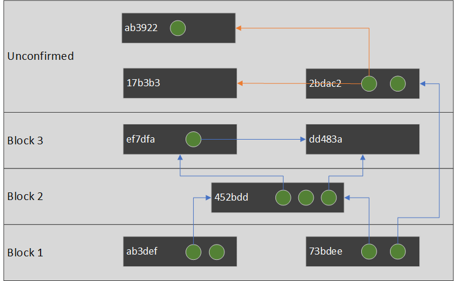
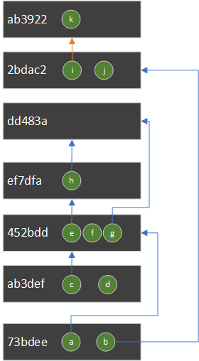
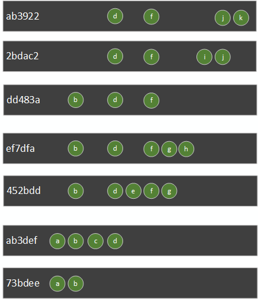

# NBXplorer design

It is however important to understand how NBXplorer has been designed so you get a better understanding on what you can do with it.
Also, in some case, you might want to do your own UTXO tracker and you may be interested in its design.

NBXplorer connects to a trusted bitcoin full node via both a P2P connection and a RPC connection.

Imagine Alice wants to use NBXplorer to track her wallet's UTXOs and transaction.

First, Alice will first ask to NBXplorer to track her [derivation scheme](https://github.com/dgarage/NBXplorer/blob/master/docs/API.md#derivation-scheme-format).

NBXplorer, will then generate the scriptPubKey belonging to this scheme along the `0/x`, `1/x` and `x` path, and save them in database.

When NBXplorer receives a transaction (within a block or not), it will check all if any input or output match any scriptPubKey it is tracking.

If it match a tracked scriptPubKey of Alice, then NBXplorer will just add this transaction (along with blockHash if any), to the list of Alice's transactions.

Because NBXplorer has all the transactions of Alice, it can reconstruct the UTXO set of Alice quite easily!

When you query the UTXO set from NBXplorer retrieves all the transactions from Alice.

If a transaction was spotted in a block, and this block is not part of the main chain anymore (reorg), NBXplorer will consider this transaction unconfirmed.

From the resulting list of transaction you can easily build this transaction graph:

* A green dot is an output.
* A gray rectangle is a transaction.
* An arrow from an output to a transaction indicate it is getting spent by another transaction.
* Orange arrows indicate a case of double spending.

Because the transactions form a acyclic graph, you can create a list which represent the nodes of this graph in a topological ordered way. (If transaction A depends on transaction B, then A will be above B in the list)

But what about the double spending case? Which transaction should be in that list? `17b3b3` or `ab3922`?

The answer is easy: the transaction which arrived last is the most likely to be confirmed eventually. This is because NBXplorer is connected to your trusted full node and your full node would never relay a transaction which conflict with another having more chance to be accepted by miners.

Assuming `ab3922` arrived last, we can remove `17b3b3` from the list before making our topological sort.

Each transactions is basically a modification to the UTXO set. By reading from the oldest transaction to the newest (from bottom to the top), you can see the reconstruction of the UTXO set.

So basically, from the transactions, we could calculate that Alice has 4 UTXOs available to spend: `d`,`f`,`j` and `k`.

Designing a wallet tracker in such way make it easy to handle reorgs. It has also the following advantages:

* To restore the UTXO set of an existing wallet, NBXplorer does not have to rescan the whole blockchain, it can just scan Bitcoin's UTXO set. (from Bitcoin's core `scantxoutset`)
* A wallet transaction list is prunable. Notice that if we delete `73bdee` from our database, we will compute exactly the same UTXO set at `ab3922`. This mean that even if your wallet has a huge number of transaction and performance slow done, you can just prune this transaction list.
* No complicated logic to handle reorgs, indexing is insert only.