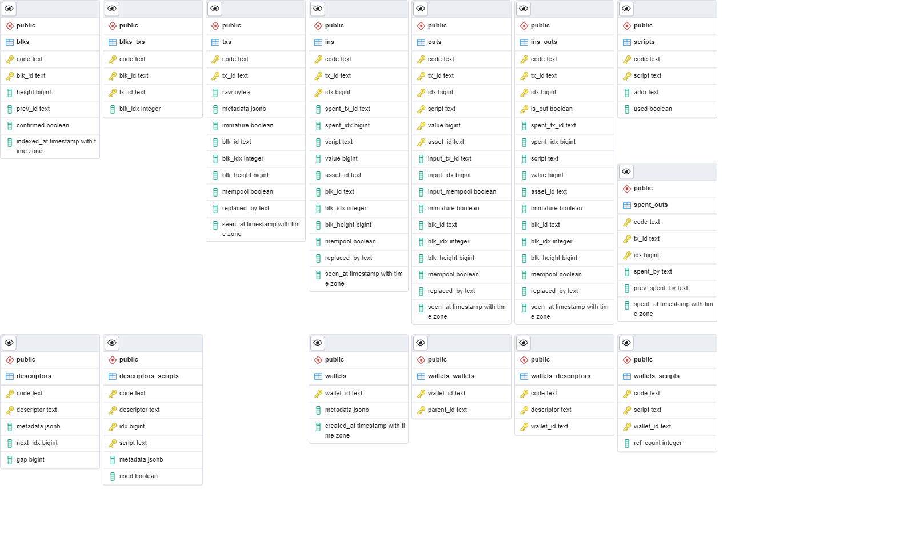

# Documentation of SQL Schema

Knowing the SQL schema is useful in three situations:
1. You want to query the schema directly as NBXplorer's API doesn't provide an API endpoint for your needs
2. You want to do your own indexer on top of it (in a different language or for a crypto we don't support)
3. You want to create your own API on top of it for features not exposed by NBXplorer's API.

This model is contained in [this SQL script](https://github.com/dgarage/NBXplorer/blob/master/NBXplorer/DBScripts/002.Model.sql).
There are additional comments there about the meaning of columns and views.

Here is a diagram:


The SQL Schema of NBXplorer is multi-tenant, multi-asset, multi-chain.
It is divided in several parts:
* Blocks and transactions: `blks`, `blks_txs` and `txs` 
* Outputs, Inputs and Scripts: `ins`, `outs`, `ins_outs`, `scripts`
* Descriptors: `descriptors`, `descriptors_scripts`
* Wallets: `wallets`, `wallets_wallets`, `wallets_descriptors`, `wallets_scripts`
* Double spending detection: `spent_outs`

Most if the data in those tables is denormalized for better query performance. The denormalization is handled automatically by triggers.

## Using wallets tables

A wallet is a collection of `wallets_descriptors` and `wallets_scripts`.
If a descriptor belongs to a wallet, then any `descriptors_scripts` will be added by trigger in the `wallets_scripts`.

A descriptor is also called `output descriptor` in the Bitcoin jargon, it represents a way to derive a collection of addresses deterministically. How to represent and interpret a descriptor is up to the indexer. (see next part)

It is also possible to add directly scripts to `wallets_scripts`.

On top of it, a wallet can have children by using `wallets_wallets`.
Any script from a child wallet will be added to the scripts of the parent wallet.

This allow you to define a hierarchy of wallet.

## Making your own indexer
An indexer typical flow is the following:
1. Insert block in blks with `confirmed='f'`
2. Call `fetch_matches` with all the ins and outs of a block
3. This will create temporary tables `matched_outs`, `matched_ins` and `matched_conflicts` the indexer can use to inspect what has been matched
4. Call save_matches to instruct the database to insert all matched ins/outs.
5. Turn `confirmed='t'` of the block.

On top of this, an indexer is responsible for creating `descriptors_scripts`. It can do so by monitoring `descriptors.gap`, and if the gap become too low, the indexer need to insert more scripts from the descriptor into `descriptors_scripts`.

This allow indexer to define their own descriptors.

## Views and functions

### Function: to_btc

`to_btc(v NUMERIC)`


Helper function format a satoshi based value into numeric bitcoin.
```SQL
SELECT to_btc(150000000);
```
Output:
```
1.50000000
```

### Function: get_wallets_recent

`get_wallets_recent(in_wallet_id TEXT, in_interval INTERVAL, in_limit INT, in_offset INT)`

`get_wallets_recent(in_wallet_id TEXT, in_code TEXT, in_interval INTERVAL, in_limit INT, in_offset INT)`

See what has going on recently in a wallet.

Better to use on Postgres 13+, as it greatly benefits from incremental sort.

For example, this returns the `5` most recent `KPrAFh3ZOIS5umpbwuYkU0sF8JW+` that happened for one year.
```SQL
SELECT * FROM get_wallets_recent('KPrAFh3ZOIS5umpbwuYkU0sF8JW+', interval '1 year', 5, 0);
```
Output:
| "code" | "asset_id" | "tx_id"                                                            | "seen_at"                       | "balance_change" | "balance_total" |
|--------|------------|--------------------------------------------------------------------|---------------------------------|------------------|-----------------|
| "BTC"  | ""         | "0e42124df086ef05b0d8cb3a5b2028828b3af27b31d7c5045803cc8541410a9f" | "2022-03-07 17:14:27.269382+00" | -199996.0        | 55020           |
| "BTC"  | ""         | "529d92bcdba7545befa4b1101256544def3ca9726ebbe4a6bd8122d7762129a2" | "2022-03-06 21:15:48.505111+00" | -229995.0        | 255016          |
| "BTC"  | ""         | "e9ce704adc9c64e099c2513169d6856bbf2fcdb2de92b465d4d63b67961b2bd2" | "2022-03-04 15:07:08.923081+00" | 200000           | 485011          |
| "BTC"  | ""         | "0581c1545ce58ecf93d70e97321fa27c7d409bb0666a124470491403cb0d91f4" | "2022-03-03 10:59:44.259948+00" | 230000           | 285011          |
| "BTC"  | ""         | "c12d1339295d6a69af8dc0fb411b67d5571d31265b385586341a4126bcda76da" | "2022-02-22 17:00:02.697965+00" | -519989.0        | 55011           |


### View: utxos

List all the UTXOs available:

**Warning**: It also returns the UTXO that are confirmed but spent in the mempool, as well as immature utxos and utxos that are being double spent.

If you want the available UTXOs which can be spent use `WHERE input_mempool IS FALSE AND immature IS FALSE`.

```SQL
SELECT * FROM utxos
WHERE input_mempool IS FALSE AND
      immature IS FALSE;
```
Output:

| "code" | "tx_id"                                                            | "idx" | "script"                                       | "value" | "asset_id" | "input_tx_id" | "input_idx" | "input_mempool" | "immature" | "blk_id"                                                           | "blk_idx" | "blk_height" | "mempool" | "replaced_by" | "seen_at"                       |
|--------|--------------------------------------------------------------------|-------|------------------------------------------------|---------|------------|---------------|-------------|-----------------|------------|--------------------------------------------------------------------|-----------|--------------|-----------|---------------|---------------------------------|
| "BTC"  | "6bf5a95c11c819ff22da3933bef2931977b4906c5820bb48ab5336a77502e4a6" | 0     | "00144d60ec59ed28267bf897543a659662cddabd384b" | 19490   | ""         | NULL          | NULL        | False           | False      | "0000010e1bc83fa20421880db7424740392a459c6ac699cefe7eac5004247e46" | NULL      | 58943        | False     | NULL          | "2021-10-08 14:25:17.96779+00"  |
| "BTC"  | "6c43019cb584391a766b1c7d5c67f09174d98b4306edeedf8586c8fdbf1048d6" | 0     | "0014f8a89fd6d6d256df24e05b01cade70d2abcdb6f6" | 113872  | ""         | NULL          | NULL        | False           | False      | "00000088cb1683d609054866ff72131af46dd7f6ee51136fdc2184f5ad1bbbf6" | NULL      | 58502        | False     | NULL          | "2021-10-05 10:21:39.483849+00" |
| "BTC"  | "1457ce82a3eb87a8982429e5185896ddee09c773519fa198de3bba4d6c9b42b7" | 0     | "0014002ca9212872715f0a5789d52084a9daecb5dce7" | 3899577 | ""         | NULL          | NULL        | False           | False      | "000001090d8f4c50c77021026d5ec5fbe2072cb95a1f5592635f70dfc30297d0" | NULL      | 59348        | False     | NULL          | "2021-10-11 12:30:12.008471+00" |
| "BTC"  | "75b7ba9a0718a95234e0b72edd2c721f3066be96eb8076f5b8f3f7160498d07f" | 1     | "0014ca76914ddc4fca3c37768e599302765ae633b62c" | 119727  | ""         | NULL          | NULL        | False           | False      | "0000009d64990b4a2b4bff9511d5c9713124905a0932026db5737a3ad44f0138" | NULL      | 60492        | False     | NULL          | "2021-10-19 10:08:54.301111+00" |
| "BTC"  | "9fc4bc1b9dc2d60202fe4e483b54afb5da7efbbfe6966e5e51f4dc6dbc2363b5" | 0     | "0014ad054e107c046e69b5ab5abc1e44d25ac9378ff6" | 9900    | ""         | NULL          | NULL        | False           | False      | "0000010003e91e0f56787b9e02b5ae424bb681f09f2ec82f8e23b19a7a93b6e6" | NULL      | 53506        | False     | NULL          | "2021-09-01 02:13:21.469658+00" |

### View: wallets_utxos

List all the wallets UTXOs available:

**Warning**: It also returns the UTXO that are confirmed but spent in the mempool, as well as immature utxos and utxos that are being double spent.

If you want the available UTXOs which can be spent use `WHERE input_mempool IS FALSE AND immature IS FALSE`.

Also, keep in mind that if an UTXO belong to two wallets, then you will see two entries for this UTXO.

```SQL
SELECT * FROM wallets_utxos
WHERE input_mempool IS FALSE AND
      immature IS FALSE;
```
Output:
| "wallet_id"                    | "code" | "tx_id"                                                            | "idx" | "script"                                       | "value" | "asset_id" | "input_tx_id" | "input_idx" | "input_mempool" | "immature" | "blk_id"                                                           | "blk_idx" | "blk_height" | "mempool" | "replaced_by" | "seen_at"                       |
|--------------------------------|--------|--------------------------------------------------------------------|-------|------------------------------------------------|---------|------------|---------------|-------------|-----------------|------------|--------------------------------------------------------------------|-----------|--------------|-----------|---------------|---------------------------------|
| "XObUaAdU2HBJk4XHGhIRya3ZObB3" | "BTC"  | "6bf5a95c11c819ff22da3933bef2931977b4906c5820bb48ab5336a77502e4a6" | 0     | "00144d60ec59ed28267bf897543a659662cddabd384b" | 19490   | ""         | NULL          | NULL        | False           | False      | "0000010e1bc83fa20421880db7424740392a459c6ac699cefe7eac5004247e46" | NULL      | 58943        | False     | NULL          | "2021-10-08 14:25:17.96779+00"  |
| "XObUaAdU2HBJk4XHGhIRya3ZObB3" | "BTC"  | "6c43019cb584391a766b1c7d5c67f09174d98b4306edeedf8586c8fdbf1048d6" | 0     | "0014f8a89fd6d6d256df24e05b01cade70d2abcdb6f6" | 113872  | ""         | NULL          | NULL        | False           | False      | "00000088cb1683d609054866ff72131af46dd7f6ee51136fdc2184f5ad1bbbf6" | NULL      | 58502        | False     | NULL          | "2021-10-05 10:21:39.483849+00" |
| "ZDP5CJ1pOWLITR1API3aJkEpdQz+" | "BTC"  | "1457ce82a3eb87a8982429e5185896ddee09c773519fa198de3bba4d6c9b42b7" | 0     | "0014002ca9212872715f0a5789d52084a9daecb5dce7" | 3899577 | ""         | NULL          | NULL        | False           | False      | "000001090d8f4c50c77021026d5ec5fbe2072cb95a1f5592635f70dfc30297d0" | NULL      | 59348        | False     | NULL          | "2021-10-11 12:30:12.008471+00" |
| "ZDP5CJ1pOWLITR1API3aJkEpdQz+" | "BTC"  | "75b7ba9a0718a95234e0b72edd2c721f3066be96eb8076f5b8f3f7160498d07f" | 1     | "0014ca76914ddc4fca3c37768e599302765ae633b62c" | 119727  | ""         | NULL          | NULL        | False           | False      | "0000009d64990b4a2b4bff9511d5c9713124905a0932026db5737a3ad44f0138" | NULL      | 60492        | False     | NULL          | "2021-10-19 10:08:54.301111+00" |
| "ZDP5CJ1pOWLITR1API3aJkEpdQz+" | "BTC"  | "9fc4bc1b9dc2d60202fe4e483b54afb5da7efbbfe6966e5e51f4dc6dbc2363b5" | 0     | "0014ad054e107c046e69b5ab5abc1e44d25ac9378ff6" | 9900    | ""         | NULL          | NULL        | False           | False      | "0000010003e91e0f56787b9e02b5ae424bb681f09f2ec82f8e23b19a7a93b6e6" | NULL      | 53506        | False     | NULL          | "2021-09-01 02:13:21.469658+00" |
| "ZDP5CJ1pOWLITR1API3aJkEpdQz+" | "BTC"  | "fec5c75b87378068f1d7d3276e90b2579e5fad8854a7002e14c275f3da9823be" | 0     | "00145674d00638e0da30ae216df4bb539e94cd2d13d1" | 1168447 | ""         | NULL          | NULL        | False           | False      | "000000b43e91de514fec8f9fc418ecb1e0a2b1d14027b01abaad9d4e39e19e8d" | NULL      | 60590        | False     | NULL          | "2021-10-20 02:18:16.980641+00" |

### View: wallets_balances

See the current balance of wallets.
* `confirmed_balance` only include the sum of value of all currently confirmed UTXOs.
* `unconfirmed_balance` will become the next `confirmed_balance` of the wallet if all non-double spent transactions get confirmed.
* `immature_balance` the sum of utxos that can't be spent before they are immature (ie, the UTXO comes from a coinbase that is less than 100 blocks old)
* `available_balance` is the balance that can be spent. (`unconfirmed_balance` - `immature_balance`)

```SQL
SELECT * FROM wallets_balances
```
Output:
| "wallet_id"                    | "code" | "asset_id" | "unconfirmed_balance" | "confirmed_balance" | "available_balance" | "immature_balance" |
|--------------------------------|--------|------------|-----------------------|---------------------|---------------------|--------------------|
| "4Tdfhh5kK8TFKcDVvsp6xdKOFdmA" | "BTC"  | ""         | 389520                | 389520              | 389520              | 0                  |
| "7ERM4iRjhk1gmeyHxEJQp0fhzh8z" | "BTC"  | ""         | 420000000             | 420000000           | 420000000           | 0                  |
| "IIKKVY87qBLjbaa/KAfUfcNP9HeC" | "BTC"  | ""         | 100000                | 100000              | 100000              | 0                  |
| "KPrAFh3ZOIS5umpbwuYkU0sF8JW+" | "BTC"  | ""         | 55020                 | 55020               | 55020               | 0                  |
| "Q+z/7E0DCjazcm5Q7t9wZSoEJ0IP" | "BTC"  | ""         | 200000                | 200000              | 200000              | 0                  |
| "XObUaAdU2HBJk4XHGhIRya3ZObB3" | "BTC"  | ""         | 133362                | 133362              | 133362              | 0                  |
| "ZDP5CJ1pOWLITR1API3aJkEpdQz+" | "BTC"  | ""         | 5197651               | 5197651             | 5197651             | 0                  |

### Materialized view: wallets_history

Provide an history of wallets (time ordered list of wallet_id, code, asset_id, balance-change, total-balance), it only takes into account confirmed transactions.

This materialized view is intensive to refresh (for 220K transactions, it takes around 5 seconds)

This is meant to be used for reports and histograms.
If you want the latest history of a wallet, use `get_wallets_recent` instead.

To refresh the materialized view, use `SELECT wallets_history_refresh();`. This will return `true` if the view has been refreshed.

```SQL
SELECT * FROM wallets_history WHERE wallet_id='KPrAFh3ZOIS5umpbwuYkU0sF8JW+';
```
Output
| "wallet_id"                    | "code" | "asset_id" | "tx_id"                                                            | "seen_at"                       | "balance_change" | "balance_total" | "nth" |
|--------------------------------|--------|------------|--------------------------------------------------------------------|---------------------------------|------------------|-----------------|-------|
| "KPrAFh3ZOIS5umpbwuYkU0sF8JW+" | "BTC"  | ""         | "0e42124df086ef05b0d8cb3a5b2028828b3af27b31d7c5045803cc8541410a9f" | "2022-03-07 17:14:27.269382+00" | -199996          | 55020           | 10    |
| "KPrAFh3ZOIS5umpbwuYkU0sF8JW+" | "BTC"  | ""         | "529d92bcdba7545befa4b1101256544def3ca9726ebbe4a6bd8122d7762129a2" | "2022-03-06 21:15:48.505111+00" | -229995          | 255016          | 9     |
| "KPrAFh3ZOIS5umpbwuYkU0sF8JW+" | "BTC"  | ""         | "e9ce704adc9c64e099c2513169d6856bbf2fcdb2de92b465d4d63b67961b2bd2" | "2022-03-04 15:07:08.923081+00" | 200000           | 485011          | 8     |
| "KPrAFh3ZOIS5umpbwuYkU0sF8JW+" | "BTC"  | ""         | "0581c1545ce58ecf93d70e97321fa27c7d409bb0666a124470491403cb0d91f4" | "2022-03-03 10:59:44.259948+00" | 230000           | 285011          | 7     |
| "KPrAFh3ZOIS5umpbwuYkU0sF8JW+" | "BTC"  | ""         | "c12d1339295d6a69af8dc0fb411b67d5571d31265b385586341a4126bcda76da" | "2022-02-22 17:00:02.697965+00" | -519989          | 55011           | 6     |
| "KPrAFh3ZOIS5umpbwuYkU0sF8JW+" | "BTC"  | ""         | "081466d46632b56d28260b928fea87addeed24cfd25e3d6504b5ddfacf6176e1" | "2022-02-04 10:42:31.059182+00" | 310000           | 575000          | 5     |
| "KPrAFh3ZOIS5umpbwuYkU0sF8JW+" | "BTC"  | ""         | "f0165974071064b32122449dbf72a67ab884723923e8536efb5cf4301bcb7469" | "2022-02-04 10:22:04.47652+00"  | 164000           | 265000          | 4     |
| "KPrAFh3ZOIS5umpbwuYkU0sF8JW+" | "BTC"  | ""         | "a4e165729e5fb406d878b3c9c8dfabd1a3465084c2c2b63602fd8704c41442ac" | "2022-02-04 09:40:00.427892+00" | 101000           | 101000          | 3     |
| "KPrAFh3ZOIS5umpbwuYkU0sF8JW+" | "BTC"  | ""         | "61247ae11a770963ffa26a63bb4ac03a14f759f7691eda8ce10175db6b6aaa77" | "2021-10-11 13:09:22.977488+00" | -850000          | 0               | 2     |
| "KPrAFh3ZOIS5umpbwuYkU0sF8JW+" | "BTC"  | ""         | "6bf5a95c11c819ff22da3933bef2931977b4906c5820bb48ab5336a77502e4a6" | "2021-10-08 14:25:17.96779+00"  | 850000           | 850000          | 1     |


### Function: get_wallets_histogram

`get_wallets_histogram(in_wallet_id TEXT, in_code TEXT, in_asset_id TEXT, in_from TIMESTAMPTZ, in_to TIMESTAMPTZ, in_interval INTERVAL)`

This function depends on `wallets_history`, as such, you should make sure the materialized view is refreshed time for up-to-date histogram.

For example, this will show how the balance of `KPrAFh3ZOIS5umpbwuYkU0sF8JW+` changed every week from `2022-01-23` to now.
```SQL
SELECT * FROM get_wallets_histogram('KPrAFh3ZOIS5umpbwuYkU0sF8JW+', 'BTC', '', '2022-01-23', CURRENT_TIMESTAMP, interval '1 week');
```
Output:
| "date"                   | "balance_change" | "balance" |
|--------------------------|------------------|-----------|
| "2022-01-23 00:00:00+00" | 0                | 0         |
| "2022-01-30 00:00:00+00" | 575000           | 575000    |
| "2022-02-06 00:00:00+00" | 0                | 575000    |
| "2022-02-13 00:00:00+00" | 0                | 575000    |
| "2022-02-20 00:00:00+00" | -519989          | 55011     |
| "2022-02-27 00:00:00+00" | 430000           | 485011    |
| "2022-03-06 00:00:00+00" | -429991          | 55020     |
| "2022-03-13 00:00:00+00" | 0                | 55020     |
| "2022-03-20 00:00:00+00" | 0                | 55020     |


### Function: nbxv1_get_wallet_id

`nbxv1_get_wallet_id(in_code TEXT, in_scheme_or_address TEXT) RETURNS TEXT`

This function is specific to the current API of NBXplorer. It calculates the `wallet_id` based on the chain code (ie. `BTC`) and an address or derivation scheme.

### Function: nbxv1_get_descriptor_id

`nbxv1_get_descriptor_id(in_code TEXT, in_scheme TEXT, in_feature TEXT) RETURNS TEXT`

This function is specific to the current API of NBXplorer. It calculates the `descriptor_id` based on the chain code (ie. `BTC`), a derivation scheme, and the feature (ie. `Deposit` or `Change`).
